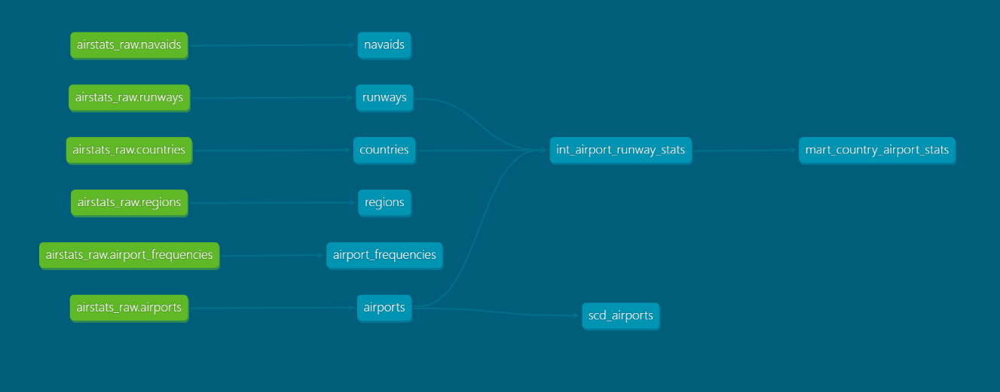
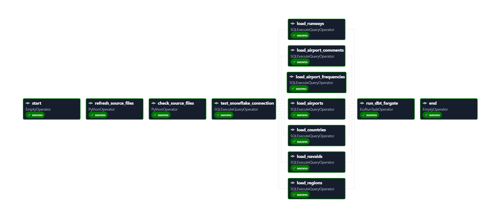

# AirStats Data Platform

AirStats is an end-to-end aviation data platform built with AWS, Snowflake, dbt, Apache Airflow / Amazon MWAA, GitHub Actions, and Power BI.

The project demonstrates a production-oriented data engineering and analytics engineering workflow covering ingestion, cloud storage, warehouse modelling, RBAC, testing, CI/CD, orchestration, and BI consumption.

---

## Architecture

```text
OurAirports CSV Source
        ↓
Python ingestion
        ↓
Amazon S3
        ↓
Snowflake RAW
        ↓
dbt
 ┌───────────────┐
 │ STAGING       │
 │ INTERMEDIATE  │
 │ MARTS         │
 │ SNAPSHOTS     │
 └───────────────┘
        ↓
AIRSTATS_PROD
        ↓
Power BI
```

Pipeline orchestration is handled by Apache Airflow running on Amazon MWAA.

GitHub Actions provides isolated CI validation and automatic deployment to Snowflake PROD.

---

## Tech Stack

| Layer | Technology |
|---|---|
| Data Source | OurAirports |
| Ingestion | Python |
| Cloud Storage | AWS S3 |
| Cloud Security | AWS IAM |
| Data Warehouse | Snowflake |
| Transformation | dbt |
| Orchestration | Apache Airflow / Amazon MWAA |
| CI/CD | GitHub Actions |
| Testing | dbt tests |
| Version Control | Git / GitHub |
| Analytics | Power BI |
| Containerisation | Docker |

---

## Data Source

The project uses aviation datasets from OurAirports, including:

- airports
- runways
- countries
- regions
- airport frequencies
- airport comments
- navigation aids

Raw CSV files are retrieved and stored in Amazon S3 before being loaded into Snowflake.

---

## Snowflake Architecture

The Snowflake environment is separated into four databases:

```text
AIRSTATS_RAW
AIRSTATS_DEV
AIRSTATS_CI
AIRSTATS_PROD
```

### RAW

Landing layer for source data loaded from S3.

```text
AIRSTATS_RAW.RAW
```

### DEV

Used during dbt development.

```text
AIRSTATS_DEV
├── STAGING
├── INTERMEDIATE
├── MARTS
└── SNAPSHOTS
```

### CI

Isolated environment used by GitHub Actions for pull-request validation.

```text
AIRSTATS_CI
├── STAGING
├── INTERMEDIATE
├── MARTS
└── SNAPSHOTS
```

### PROD

Production environment populated only after validated code is merged into `main`.

```text
AIRSTATS_PROD
├── STAGING
├── INTERMEDIATE
├── MARTS
└── SNAPSHOTS
```

---

## Snowflake RBAC

The project follows the principle:

```text
Users → Roles → Privileges → Objects
```

Dedicated identities are used for separate workloads.

| User | Role | Responsibility |
|---|---|---|
| `INGESTOR_USER` | `INGESTOR_ROLE` | Load data into RAW |
| `DBT_USER` | `DBT_ROLE` | Development transformations |
| `DBT_CI_USER` | `DBT_CI_ROLE` | CI validation |
| `DBT_PROD_USER` | `DBT_PROD_ROLE` | Production deployment |
| `BI_ANALYST_USER` | `ANALYST_ROLE` | Read production marts |

This keeps ingestion, transformation, CI, production deployment, and analytics access separated according to least-privilege principles.

The complete Snowflake infrastructure and RBAC configuration is documented under:

```text
_snowflake/
```

---

## dbt Transformation Layer

The dbt project follows a layered modelling approach:

```text
RAW
 ↓
STAGING
 ↓
INTERMEDIATE
 ↓
MARTS
```

### Staging

Source tables are cleaned, renamed, and standardized.

### Intermediate

Reusable transformation and business logic is implemented here.

Example:

```text
int_airport_runway_stats
```

This model combines airport, country, and runway information at airport grain.

### Marts

The primary analytics mart is:

```text
mart_country_airport_stats
```

It provides country-level metrics including:

- airport count
- total runway count
- average runways per airport
- maximum runways at a single airport

---

## dbt Features Implemented

The project includes:

- dbt sources
- staging models
- intermediate models
- marts
- incremental models
- snapshots / SCD Type 2
- schema tests
- relationship tests
- model contracts
- documentation
- custom schema routing
- environment-specific deployment

---

## dbt Lineage



---

## Incremental Processing

Airport comments are processed incrementally rather than rebuilding the full dataset on every run.

This demonstrates change-based processing for event-style datasets.

---

## Snapshots

Airport attributes are tracked using dbt snapshots with the `check` strategy.

This enables historical tracking of changes such as:

- airport name
- airport type
- country
- region
- municipality
- scheduled service status

---

## Airflow / Amazon MWAA

The full pipeline is orchestrated using Apache Airflow running on Amazon MWAA.

The DAG performs the following sequence:

```text
start
 ↓
refresh_source_files
 ↓
check_source_files
 ↓
test_snowflake_connection
 ↓
load RAW tables
 ↓
run dbt target
 ↓
end
```

Independent RAW table loads run in parallel before dbt transformations begin.

### Airflow DAG



---

## CI/CD

GitHub Actions provides automated validation and deployment.

### CI

Every pull request targeting `main` triggers CI.

```text
Feature Branch
      ↓
Pull Request
      ↓
GitHub Actions
      ↓
DBT_CI_USER
      ↓
AIRSTATS_CI
```

CI performs:

- dbt dependency installation
- project parsing
- Snowflake connection validation
- Slim CI
- model builds
- tests

### Slim CI

Slim CI compares the pull request against the dbt manifest from `main`.

```bash
dbt build --select "state:modified+" --defer --state ../state
```

This validates only modified models and affected downstream dependencies rather than rebuilding the entire project.

### Branch Protection

`main` is protected by:

- required pull requests
- required dbt CI status check
- blocked force pushes

### Continuous Deployment

After a successful PR is merged:

```text
Merge to main
      ↓
GitHub Actions CD
      ↓
DBT_PROD_USER
      ↓
AIRSTATS_PROD
```

The production workflow executes:

```bash
dbt build --target prod
```

This separates development, CI validation, and production deployment.

---

## Power BI Analytics

Power BI connects to:

```text
AIRSTATS_PROD.MARTS
```

using the read-only path:

```text
BI_ANALYST_USER
→ ANALYST_ROLE
```

The dashboard provides:

- total airport count
- total runway count
- airports by country
- runways by country
- average runways per airport
- maximum runways per airport
- country filtering

### Global Airport Infrastructure Overview


---

## Key Engineering Decisions

### Separate DEV, CI, and PROD Environments

This prevents pull-request validation from modifying development or production objects.

### Dedicated Service Identities

GitHub Actions uses separate Snowflake identities for CI and PROD deployment.

### Least-Privilege RBAC

Each role receives only the privileges required for its workload.

### Slim CI

Only modified dbt nodes and affected downstream dependencies are validated.

### Dedicated Warehouses

Separate warehouses are used for ingestion, dbt, and analytics workloads.

### Production Marts for BI

Power BI consumes curated production marts rather than RAW or intermediate objects.

---

## Repository Structure

```text
airstats_dbt/
│
├── .github/
│   └── workflows/
│       ├── dbt-ci.yml
│       └── dbt-cd.yml
│
├── _screenshots/
│   ├── lineage_graph.png
│   ├── airstats_pipeline-graph.png
│   └── Global Airport Infra Overview.png
│
├── _snowflake/
│
├── airflow/
│   └── dags/
│
├── docker/
│
├── macros/
│
├── models/
│   ├── staging/
│   ├── intermediate/
│   ├── incremental/
│   └── marts/
│
├── snapshots/
├── tests/
├── dbt_project.yml
└── README.md
```

---

## Security

Sensitive credentials are not committed to Git.

Secrets are managed through:

- GitHub Actions Secrets
- environment variables
- Snowflake service identities
- AWS IAM roles
- Snowflake Storage Integration

Files such as local dbt profiles and `.env` files are excluded using `.gitignore`.

---

## Project Outcome

AirStats demonstrates an end-to-end modern analytics platform combining:


```text
Python
AWS
Snowflake
dbt
Airflow / MWAA
GitHub Actions
Power BI
```


The project covers the complete lifecycle from raw source ingestion through transformation, automated testing, CI/CD, orchestration, production deployment, and business intelligence consumption.